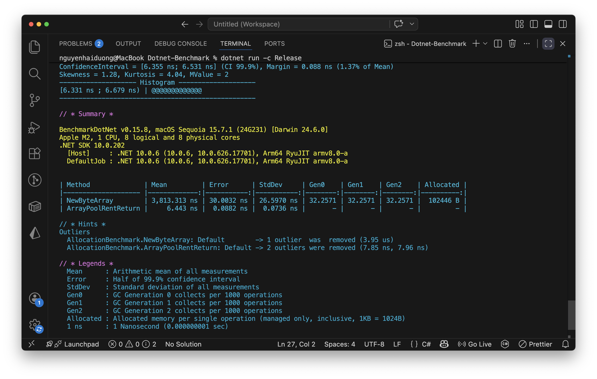

# Benchmark: new byte[] vs ArrayPool<byte>

Project benchmark hiệu năng và memory allocation trong .NET bằng BenchmarkDotNet.

## Mục tiêu

So sánh:

- `new byte[]`
- `ArrayPool<byte>.Shared.Rent()`

để xem ảnh hưởng đến:

- Performance
- GC Pressure
- Memory Allocation
- Throughput

---

## Công nghệ sử dụng

- .NET 10
- BenchmarkDotNet
- ArrayPool<T>
- C#

---

## Cấu trúc project

```txt
Dotnet-Benchmark/
│
├── Program.cs
├── AllocationBenchmark.cs
├── README.md
│
├── screenshots/
│   └── benchmark-result.png
│
└── BenchmarkDotNet.Artifacts/
```


